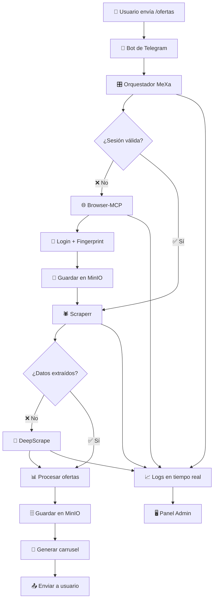
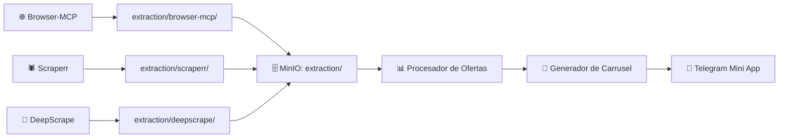

# 🤖 MeXa Telegram Bot - Guía de Integración Completa

## 🎯 Integración del Bot con el Sistema MeXa

El bot de Telegram de MeXa está diseñado para interactuar directamente con los datos extraídos por los módulos del sistema (Browser-MCP, Scraperr, DeepScrape) y presentarlos a los usuarios de manera intuitiva.

---

## 🚀 Configuración Rápida del Bot

### Paso 1: Crear el Bot en Telegram
1. Abre la aplicación de **Telegram** o accede desde la web.
2. Busca el contacto [@BotFather](https://t.me/BotFather) (este es un bot oficial de Telegram para crear nuevos bots).
3. Envía el comando `/newbot` al @BotFather.
4. Sigue las instrucciones:
   - Elige un nombre para tu bot (por ejemplo, "MeXa Shopping Bot").
   - Elige un nombre de usuario único que termine en "bot" (por ejemplo, "mexashoppingbot").
5. Al finalizar, @BotFather te proporcionará un **token de acceso**, algo como `1234567890:ABCdefGHIjklMNOpqrstUVWxyz`.

### Paso 2: Configurar Variables de Entorno en MeXa

Agrega las siguientes variables a tu archivo `.env`:

```bash
# Configuración del Bot de Telegram
TELEGRAM_BOT_TOKEN=1234567890:ABCdefGHIjklMNOpqrstUVWxyz
TELEGRAM_ADMIN_CHAT_IDS=123456789,987654321  # IDs de administradores
MAX_OFFERS_PER_MESSAGE=10                     # Máximo ofertas por mensaje
DEFAULT_MAX_PRICE=1000                        # Precio máximo por defecto (€)
DEFAULT_MIN_DISCOUNT=0                        # Descuento mínimo por defecto (%)

# Configuración de Farfetch (para autenticación)
FF_EMAIL=tu_email@example.com
FF_PASSWORD=tu_password_segura
```

### Paso 3: Iniciar el Bot Integrado con MeXa

```bash
# Opción 1: Iniciar bot junto con el sistema completo
npm run dev

# Opción 2: Iniciar solo el bot (en desarrollo)
npm run bot:dev

# Opción 3: Iniciar bot en producción
npm run bot
```

---

## 🔄 Flujo de Interacción Bot ↔ Sistema MeXa

### 📊 Diagrama de Flujo de Datos



---

## 🎮 Comandos Disponibles del Bot

### 📱 Comandos Principales

| Comando | Descripción | Ejemplo |
|---------|-------------|---------|
| `/start` | Iniciar bot y mostrar bienvenida | `/start` |
| `/ofertas` | Buscar ofertas de Farfetch | `/ofertas` |
| `/filtros` | Configurar filtros personalizados | `/filtros` |
| `/favoritos` | Ver productos favoritos | `/favoritos` |
| `/perfil` | Ver configuración personal | `/perfil` |
| `/help` | Mostrar ayuda y comandos | `/help` |
| `/status` | Estado del sistema (solo admins) | `/status` |

### 🔧 Comandos de Administración

| Comando | Descripción | Solo Admins |
|---------|-------------|-------------|
| `/stats` | Estadísticas del sistema | ✅ |
| `/logs` | Ver logs recientes | ✅ |
| `/restart` | Reiniciar módulos | ✅ |
| `/broadcast` | Mensaje a todos los usuarios | ✅ |

---

## 📊 Integración con Datos del Sistema MeXa

### 🗄️ Fuentes de Datos

El bot consume datos directamente de MinIO organizados por módulos:

```typescript
// Estructura de datos que consume el bot
interface TelegramOffer {
  id: string;
  precio: number;
  referencia: string;
  categoria: 'niño' | 'hombre' | 'mujer' | 'unisex';
  cantidadDisponible: number;
  estatus: 'disponible' | 'agotado' | 'limitado';
  imagenes: TelegramImage[];
  marca: string;
  descripcion: string;
  tallas: string[];
  colores: string[];
  descuento?: number;
  fechaCreacion: string;
  fuente: 'browser-mcp' | 'scraperr' | 'deepscrape'; // ← Módulo que extrajo los datos
}
```

### 🔄 Flujo de Procesamiento de Datos



### 📱 Mini App Telegram Integrada

El bot incluye una **Mini App** estilo Tinder para navegar ofertas:

**Características:**
- ✅ **Carrusel interactivo** con gestos swipe
- ✅ **Imágenes optimizadas** 375x667px para móviles
- ✅ **Filtros en tiempo real** por precio, marca, categoría
- ✅ **Sistema de favoritos** persistente en MinIO
- ✅ **Datos actualizados** desde todos los módulos de extracción

**Acceso:**
```bash
# URL de la Mini App (se configura automáticamente)
https://tu-dominio.com/telegram-app

# O localmente para desarrollo:
http://localhost:3000/telegram-app
```

---

## 🔧 APIs del Bot Integradas con MeXa

### 📡 Endpoints Específicos del Bot

| Endpoint | Método | Descripción |
|----------|--------|-------------|
| `/api/telegram/offers` | GET | Obtener ofertas formateadas para Telegram |
| `/api/telegram/favorites` | GET/POST/DELETE | Gestionar favoritos por usuario |
| `/api/telegram/user-profile` | GET/PUT | Perfil y configuración de usuario |
| `/api/telegram/stats` | GET | Estadísticas de uso del bot |
| `/api/bot/status` | GET | Estado del bot y conexión |

### 🎯 Ejemplo de Uso de APIs

```typescript
// Obtener ofertas para un usuario específico
GET /api/telegram/offers?chatId=123456789&limit=10&filters={"maxPrice":500}

// Respuesta:
{
  "success": true,
  "offers": [
    {
      "id": "offer_001",
      "precio": 299.99,
      "referencia": "FAR123456",
      "categoria": "hombre",
      "marca": "Gucci",
      "imagenes": [
        {
          "url": "https://cdn.farfetch.com/...",
          "width": 375,
          "height": 667,
          "optimized": true
        }
      ],
      "fuente": "scraperr", // ← Indica qué módulo extrajo estos datos
      "fechaCreacion": "2024-01-15T10:30:00Z"
    }
  ],
  "totalCount": 150,
  "hasMore": true
}
```

---

## 🧪 Probar el Bot Completo

### Paso 1: Configuración Completa
```bash
# 1. Configurar variables de entorno
cp .env.example .env
# Editar .env con tu TELEGRAM_BOT_TOKEN

# 2. Iniciar sistema completo
npm run dev

# 3. Iniciar bot (en otra terminal)
npm run bot:dev
```

### Paso 2: Probar Funcionalidades
```bash
# 1. Buscar tu bot en Telegram: @tu_bot_username
# 2. Enviar comando: /start
# 3. Probar comando: /ofertas
# 4. Verificar que aparezcan datos extraídos por los módulos
# 5. Probar Mini App desde el botón inline
```

### Paso 3: Verificar Integración
```bash
# Verificar que el bot recibe datos de todos los módulos:
curl http://localhost:3000/api/telegram/offers

# Verificar estado del bot:
curl http://localhost:3000/api/bot/status

# Ver logs del bot en tiempo real:
# Panel Admin → Logs → Filtrar por "Telegram Bot"
```

---

## 🎯 Resultado Final

**El bot de Telegram ahora:**
- ✅ **Consume datos** de todos los módulos (Browser-MCP, Scraperr, DeepScrape)
- ✅ **Presenta ofertas** en formato carrusel interactivo
- ✅ **Mantiene favoritos** persistentes en MinIO
- ✅ **Filtra contenido** según preferencias del usuario
- ✅ **Integra Mini App** estilo Tinder para navegación móvil
- ✅ **Proporciona estadísticas** de uso y rendimiento
- ✅ **Funciona en tiempo real** con datos actualizados

### 📱 Experiencia del Usuario Final

1. **Usuario envía** `/ofertas` al bot
2. **Sistema extrae** datos usando Browser-MCP → Scraperr → DeepScrape
3. **Bot procesa** y formatea ofertas desde MinIO
4. **Usuario recibe** carrusel interactivo con ofertas reales
5. **Usuario navega** con gestos swipe en Mini App
6. **Favoritos se guardan** automáticamente en el sistema

---

## 🤝 Soporte y Desarrollo

¿Necesitas ayuda específica con alguna parte del proceso?

**Recursos disponibles:**
- 📖 **Documentación completa**: `README.md`
- 🔧 **APIs documentadas**: Panel Admin → APIs
- 📊 **Logs en tiempo real**: Panel Admin → Logs
- 🗄️ **Datos en MinIO**: Console MinIO (puerto 9003)

**Comandos útiles:**
```bash
# Ver logs del bot
npm run bot:dev

# Verificar estado del sistema
curl http://localhost:3000/api/system/status

# Acceder al panel de administración
http://localhost:3000/admin
```