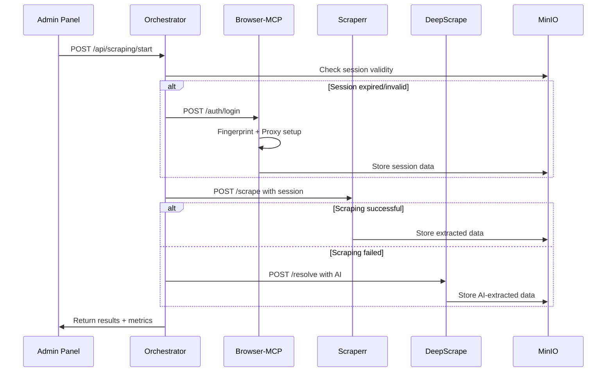

# 🛠️ Guía Técnica de Administración - MeXa

## 📋 Resumen Ejecutivo

MeXa es un sistema de orquestación de web scraping que coordina múltiples módulos independientes para extraer datos de Farfetch. Utiliza una arquitectura de microservicios con comunicación HTTP/REST y almacenamiento distribuido en MinIO.

## 🏗️ Arquitectura del Sistema

### Componentes Principales

```
┌─────────────────────────────────────────────────────────────┐
│                🎛️ ORQUESTADOR PRINCIPAL                      │
│                   (Node.js - Puerto 3000)                  │
├─────────────────────────────────────────────────────────────┤
│ • Coordinación de módulos via HTTP REST API                │
│ • Gestión de flujos de trabajo con fallback automático     │
│ • Panel de administración web con SSE logs                 │
│ • API Gateway para servicios externos                      │
└─────────────────────────────────────────────────────────────┘
                              │
                              ▼
┌─────────────────┬─────────────────┬─────────────────────────┐
│  🌐 Browser-MCP  │  🕷️ Scraperr    │  🤖 DeepScrape         │
│  (Puerto 3001)  │  (Puerto 3002)  │  (Puerto 3003)         │
├─────────────────┼─────────────────┼─────────────────────────┤
│ • Session mgmt  │ • DOM parsing   │ • ML-based element      │
│ • Cookie persist│ • CSS selectors │   detection             │
│ • Fingerprinting│ • Pagination    │ • Dynamic content       │
│ • Proxy rotation│ • Data extract  │ • Semantic analysis     │
└─────────────────┴─────────────────┴─────────────────────────┘
                              │
                              ▼
┌─────────────────────────────────────────────────────────────┐
│                    🗄️ MinIO STORAGE                         │
│                  S3-Compatible Object Store                │
├─────────────────────────────────────────────────────────────┤
│  Bucket: mexa-data                                         │
│  • telegram/offers/     - Structured offer data           │
│  • telegram/users/      - User profiles & preferences     │
│  • scraping/           - Raw & processed scraping data    │
│  • sessions/           - Browser sessions & cookies       │
└─────────────────────────────────────────────────────────────┘
```

## 🔧 Configuración del Sistema

### Variables de Entorno Críticas

```bash
# Core Configuration
NODE_ENV=production|development
PORT=3000
LOG_LEVEL=info|debug|warn|error

# MinIO S3-Compatible Storage
MINIO_ENDPOINT=localhost
MINIO_PORT=9002
MINIO_ACCESS_KEY=minioadmin
MINIO_SECRET_KEY=minioadmin123
MINIO_BUCKET=mexa-data
MINIO_USE_SSL=false

# External Services Endpoints
BROWSER_MCP_URL=http://localhost:3001
SCRAPERR_URL=http://localhost:3002
DEEPSCRAPE_URL=http://localhost:3003

# Authentication Credentials
FF_EMAIL=your_farfetch_email@domain.com
FF_PASSWORD=your_secure_password

# Telegram Integration (Optional)
TELEGRAM_BOT_TOKEN=your_bot_token_from_botfather
TELEGRAM_CHAT_ID=your_chat_id_for_notifications
```

### Inicialización de Servicios

```bash
# 1. MinIO Storage Service
docker run -d --name minio-mexa \
  -p 9002:9000 -p 9003:9001 \
  -e "MINIO_ROOT_USER=minioadmin" \
  -e "MINIO_ROOT_PASSWORD=minioadmin123" \
  -v /opt/mexa/data:/data \
  quay.io/minio/minio server /data --console-address ":9001"

# 2. Browser-MCP Service
cd external/browser-mcp
npm install && npm start

# 3. Scraperr Service  
cd external/scraperr
pip install -r requirements.txt && python app.py

# 4. DeepScrape Service
cd external/deepscrape
npm install && npm start

# 5. Main Orchestrator
npm install && npm run build && npm start
```

## 📊 Panel de Administración

### Acceso y Autenticación

- **URL**: `http://localhost:3000/admin`
- **Autenticación**: Session-based (configurar en .env)
- **Roles**: Admin, Operator, Viewer

### Funcionalidades del Dashboard

#### 1. **Monitoreo en Tiempo Real**
- **Logs SSE Stream**: `/admin` → pestaña "Logs"
- **Métricas de Sistema**: CPU, RAM, Network I/O
- **Estado de Servicios**: Health checks automáticos cada 30s
- **Alertas**: Configurables por umbral y tipo de evento

#### 2. **Gestión de Workflows**
- **Ejecución Manual**: Trigger de scraping bajo demanda
- **Programación**: Cron jobs para ejecución automática
- **Monitoreo**: Estado de workflows activos y histórico
- **Configuración**: Parámetros de timeout, reintentos, fallbacks

#### 3. **Administración de Datos**
- **MinIO Browser**: Interfaz para explorar bucket `mexa-data`
- **Data Export**: Descarga de datasets en JSON/CSV
- **Cleanup**: Purga automática de datos antiguos
- **Backup**: Configuración de respaldos incrementales

## 🔍 Sistema de Logs Avanzado

### Configuración del Logger

```typescript
interface LoggerConfig {
  maxLogs: 1000;           // Buffer circular en memoria
  retention: '7d';         // Retención en MinIO
  levels: ['debug', 'info', 'warn', 'error', 'fatal'];
  modules: [
    'Orchestrator',        // Core coordination logic
    'Browser-MCP',         // Session & authentication
    'Scraperr',           // Basic scraping operations
    'DeepScrape',         // AI-powered extraction
    'MinIO',              // Storage operations
    'Telegram Bot',       // Bot interactions
    'API Gateway',        // REST API requests
    'Workflow Engine'     // Job scheduling & execution
  ];
  filters: {
    performance: true,     // Log execution times
    errors: true,         // Stack traces
    security: true        // Auth attempts
  };
}
```

### Análisis de Logs

```bash
# Real-time monitoring
curl -N http://localhost:3000/api/logs?stream=true

# Filtered queries
curl "http://localhost:3000/api/logs?module=Scraperr&level=error&since=2024-01-01"

# Export for analysis
curl "http://localhost:3000/api/logs?format=csv" > logs_export.csv
```

## 🚀 Operaciones de Scraping

### Flujo de Ejecución



### Configuración de Fallbacks

```typescript
const orchestrationConfig = {
  modules: {
    'browser-mcp': {
      timeout: 30000,      // 30s for auth operations
      retries: 2,
      healthCheck: '/health',
      priority: 1
    },
    'scraperr': {
      timeout: 15000,      // 15s for basic scraping
      retries: 3,
      healthCheck: '/status',
      priority: 2
    },
    'deepscrape': {
      timeout: 45000,      // 45s for AI processing
      retries: 1,
      healthCheck: '/ready',
      priority: 3
    }
  },
  fallbackStrategy: 'sequential', // sequential | parallel | weighted
  circuitBreaker: {
    failureThreshold: 5,
    resetTimeout: 60000
  }
};
```

## 🗄️ Gestión de Datos MinIO

### Estructura de Bucket

```
mexa-data/
├── telegram/
│   ├── offers/
│   │   ├── 2024-01-15/
│   │   │   ├── offer-{uuid}.json
│   │   │   └── images/
│   │   │       └── {offer-id}-{index}.webp
│   │   └── favorites/
│   │       └── user-{chatId}.json
│   └── users/
│       └── {chatId}/
│           ├── profile.json
│           ├── filters.json
│           └── activity.json
├── scraping/
│   ├── sessions/
│   │   └── {date}/
│   │       ├── raw-{timestamp}.ndjson
│   │       ├── processed-{timestamp}.json
│   │       └── metadata.json
│   └── selectors/
│       ├── current.json
│       └── history/
│           └── {date}-selectors.json
└── sessions/
    ├── browser-mcp/
    │   └── {sessionId}.json
    └── fingerprints/
        └── active-{date}.json
```

### Políticas de Retención

```json
{
  "retentionPolicies": {
    "telegram/offers": "30d",
    "telegram/users": "1y", 
    "scraping/sessions": "7d",
    "sessions/browser-mcp": "24h",
    "logs": "7d"
  },
  "compressionRules": {
    "*.json": "gzip",
    "*.ndjson": "lz4"
  },
  "backupSchedule": "0 2 * * *"
}
```

## 🔒 Seguridad y Monitoreo

### Métricas de Rendimiento

- **Latencia de Scraping**: P50, P95, P99
- **Tasa de Éxito**: Por módulo y global
- **Throughput**: Ofertas procesadas por hora
- **Disponibilidad**: Uptime de servicios
- **Uso de Recursos**: CPU, RAM, Storage I/O

### Alertas Configurables

```yaml
alerts:
  - name: "High Error Rate"
    condition: "error_rate > 0.1"
    duration: "5m"
    action: "email,slack"
  
  - name: "Service Down"
    condition: "service_health == false"
    duration: "30s"
    action: "email,sms,restart"
  
  - name: "Storage Full"
    condition: "storage_usage > 0.9"
    duration: "1m"
    action: "cleanup,email"
```

## 🛠️ Troubleshooting

### Problemas Comunes

1. **Servicios No Responden**
   ```bash
   # Check service status
   curl http://localhost:3001/health
   curl http://localhost:3002/status
   curl http://localhost:3003/ready
   
   # Restart services
   docker restart minio-mexa
   pm2 restart browser-mcp scraperr deepscrape
   ```

2. **MinIO Connection Issues**
   ```bash
   # Test connectivity
   mc alias set mexa-local http://localhost:9002 minioadmin minioadmin123
   mc ls mexa-local/mexa-data
   
   # Check bucket permissions
   mc policy get mexa-local/mexa-data
   ```

3. **High Memory Usage**
   ```bash
   # Monitor processes
   htop -p $(pgrep -f "node|python")
   
   # Clear logs buffer
   curl -X DELETE http://localhost:3000/api/logs
   ```

### Logs de Diagnóstico

```bash
# Enable debug logging
export LOG_LEVEL=debug
npm restart

# Monitor specific module
curl -N "http://localhost:3000/api/logs?stream=true&module=Scraperr&level=debug"

# Export system state
curl http://localhost:3000/api/system/status > system_state.json
```
