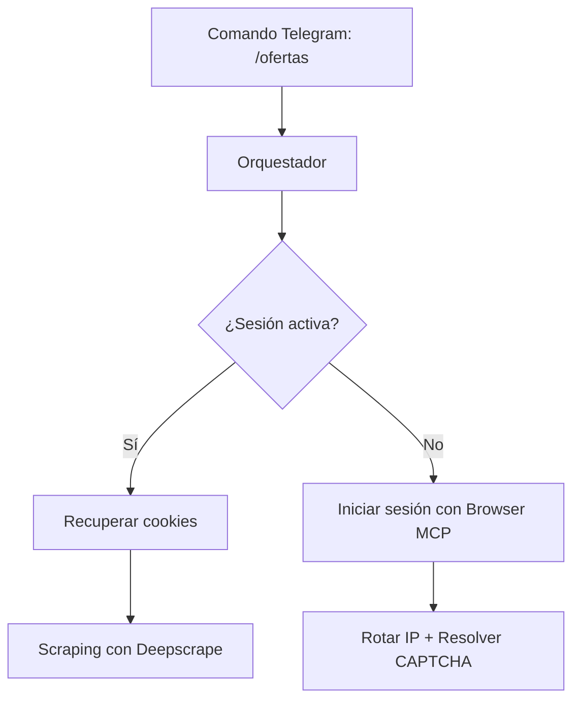
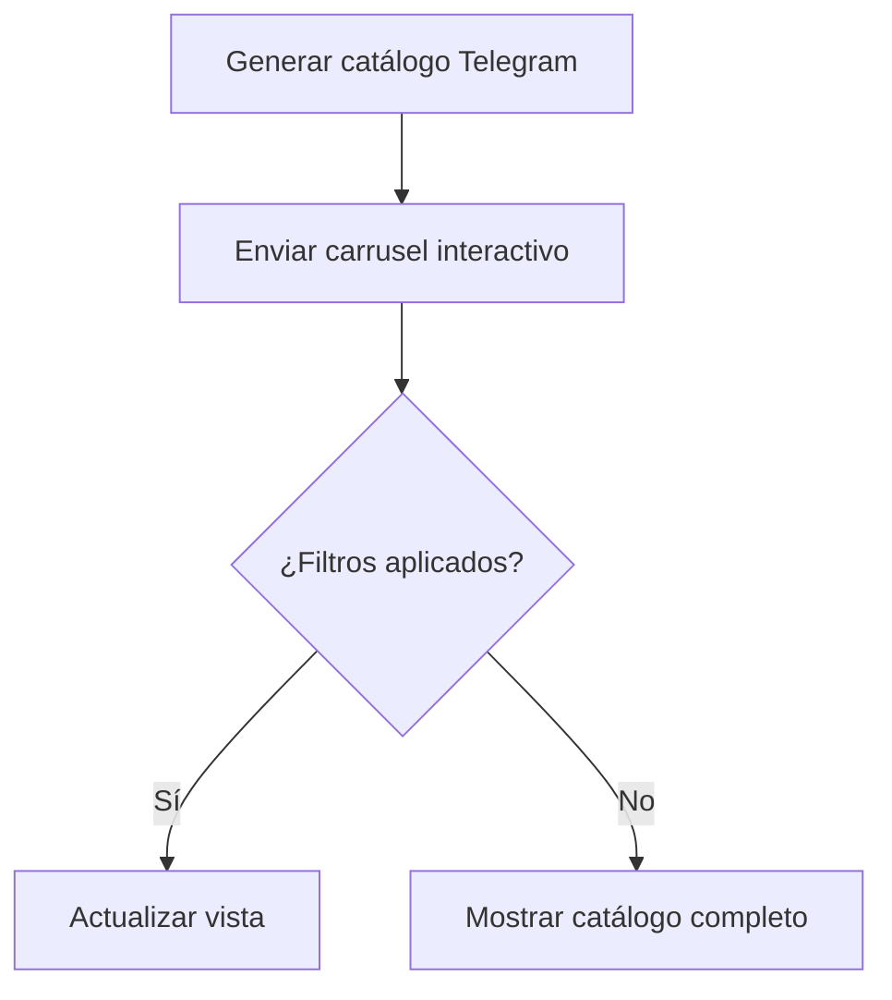
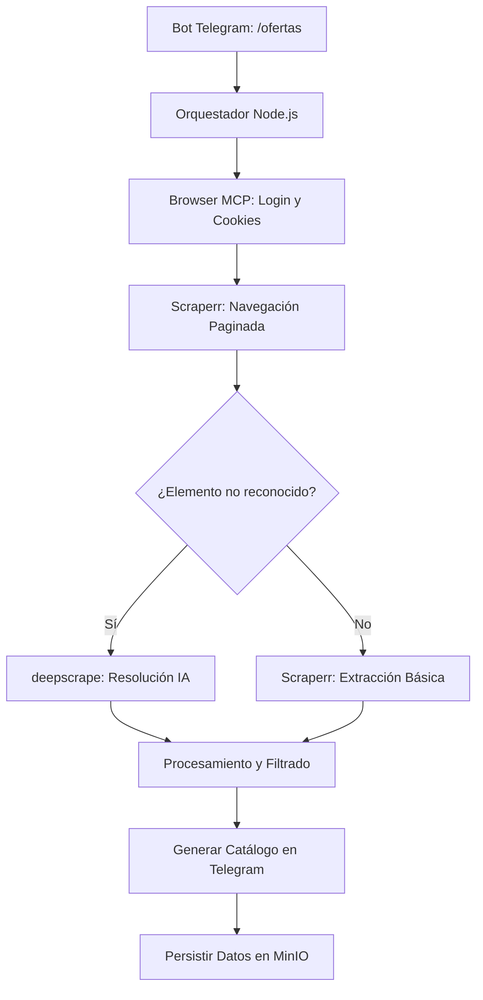

# Planificación Sistema Farfetch Scraper & Telegram Bot

## 1. Arquitectura General

### Componentes Principales
1. **Orquestador Node.js**
   - Gestión de flujos
   - Integración de servicios
   - Manejo de errores y reintentos

2. **Sistema de Scraping**
   - Browser MCP (Autenticación y gestión de sesiones)
   - Scraperr (Navegación y scraping básico)
   - Deepscrape (Resolución de elementos dinámicos)

3. **Interfaz Telegram**
   - Bot interactivo
   - Catálogos de ofertas
   - Sistema de filtros

4. **Sistema de Persistencia**
   - MinIO para workflows y sesiones
   - Almacenamiento de datos históricos

## 2. Flujo Principal

### Fase 1: Autenticación y Sesión


### Fase 2: Scraping y Procesamiento
```mermaid
graph TD
    G[Scraping con Deepscrape] --> H{¿Estructura cambiada?}
    H -->|Sí| I[Ajustar selectores en tiempo real]
    H -->|No| J[Extraer datos]
    J --> K[Filtrar ofertas (lógica de negocio)]
    K --> L[Generar catálogo Telegram]
```

### Fase 3: Presentación en Telegram


## 3. Estructura de Datos

### Entidades Principales
```typescript
interface Session {
    cookies: string;
    fingerprint: string;
    proxy: string;
    lastUsed: Date;
    status: 'active' | 'expired';
}

interface Offer {
    id: string;
    brand: string;
    name: string;
    price: {
        current: number;
        original: number;
        discount: number;
    };
    imageUrl: string;
    link: string;
    metadata: {
        timestamp: Date;
        source: 'scraperr' | 'deepscrape' | 'browser-mcp';
        confidence: number;
    };
}

interface TelegramState {
    chatId: string;
    filters: {
        minPrice?: number;
        maxPrice?: number;
        brand?: string;
    };
    lastUpdate: Date;
}
```

## 4. Manejo de URLs y Navegación

### Sistema de URLs
```typescript
const urlConfig = {
    base: 'https://www.farfetch.com',
    endpoints: {
        login: '/login',
        offers: '/shopping/women/private-sale/all/items.aspx',
        product: '/product/'
    },
    dynamic: {
        detect: async (url) => {
            // Usar deepscrape para detectar cambios
            return await deepscrape.detect(url);
        },
        update: async (url) => {
            // Actualizar selectores
            return await deepscrape.updateSelectors(url);
        }
    }
};
```

## 5. Sistema Anti-Baneo

### Configuración de Seguridad
```typescript
const antiBanConfig = {
    // Patrones de uso
    activity: {
        timeWindow: {
            start: 9, // 9AM
            end: 21   // 9PM
        },
        delay: {
            mean: 4200, // 4.2s
            stdDev: 1800 // 1.8s
        }
    },
    
    // Rotación de huellas
    fingerprints: {
        deviceTypes: {
            mobile: 0.7,
            desktop: 0.3
        },
        rotation: {
            cores: [4, 6, 8],
            languages: ['es', 'en', 'pt']
        }
    },
    
    // Límites operativos
    limits: {
        sessionsPerDay: 8,
        productsPerSession: 100,
        proxyRotation: {
            minTime: 180, // 3 min
            maxTime: 300  // 5 min
        }
    }
};
```

## 6. Sistema de Filtros Telegram

### Estructura de Filtros
```typescript
const filterCommands = {
    price: {
        min: '/precio_min',
        max: '/precio_max'
    },
    brand: '/marca',
    category: '/categoria'
};

interface FilterState {
    price: {
        min: number | null;
        max: number | null;
    };
    brand: string | null;
    category: string | null;
}
```

## 7. Workflows y Documentación

### 7.1. Flujo de Autenticación

#### Workflow YAML
```yaml
name: auth-flow
version: 1.0
description: Workflow de autenticación para Farfetch

environment:
  FF_EMAIL: ${FF_EMAIL}
  FF_PASSWORD: ${FF_PASSWORD}
  PROXY_POOL: ${PROXY_POOL}

steps:
  - name: setup-session
    type: browser-mcp
    config:
      fingerprint:
        deviceType: mobile
        browser: chrome
        language: es
      proxy:
        type: residential
        country: ES
        rotation: 300

  - name: login
    type: browser-mcp
    dependsOn: setup-session
    config:
      url: https://www.farfetch.com/login
      actions:
        - type: wait
          selector: #email
          timeout: 10000
        - type: type
          selector: #email
          value: ${FF_EMAIL}
        - type: type
          selector: #password
          value: ${FF_PASSWORD}
        - type: click
          selector: #login-btn
          waitForNavigation: true

  - name: save-session
    type: browser-mcp
    dependsOn: login
    config:
      action: save
      storage: minio
      path: sessions/${USER_ID}
```

#### Documentación Detallada

##### Descripción
El flujo de autenticación maneja el proceso completo de inicio de sesión en Farfetch y persistencia de la sesión.

##### Flujo Detallado
1. **Setup de Sesión**
   - Configuración de huella digital móvil
   - Selección de proxy residencial
   - Inicialización del navegador

2. **Proceso de Login**
   - Navegación a página de login
   - Espera por elementos de formulario
   - Ingreso de credenciales
   - Envío del formulario
   - Verificación de navegación exitosa

3. **Persistencia de Sesión**
   - Extracción de cookies y localStorage
   - Almacenamiento en MinIO
   - Asociación con ID de usuario

##### Variables de Entorno
- `FF_EMAIL`: Email de usuario
- `FF_PASSWORD`: Contraseña de usuario
- `PROXY_POOL`: Pool de proxies a usar
- `USER_ID`: Identificador único del usuario

##### Manejo de Errores
- Intentos máximos: 3
- Retraso entre intentos: 5 segundos
- Rotación automática de proxy
- Captura y reporte de CAPTCHAs

### 7.2. Flujo de Scraping Principal

#### Workflow YAML
```yaml
name: scraping-flow
version: 1.0
description: Workflow principal de scraping de ofertas

environment:
  SESSION_ID: ${SESSION_ID}
  CATEGORY: ${CATEGORY}
  PAGE_LIMIT: 5

steps:
  - name: restore-session
    type: browser-mcp
    config:
      action: restore
      storage: minio
      path: sessions/${SESSION_ID}

  - name: navigate-offers
    type: browser-mcp
    dependsOn: restore-session
    config:
      url: https://www.farfetch.com/${CATEGORY}
      actions:
        - type: wait
          selector: .product-card
          timeout: 15000

  - name: scroll-page
    type: browser-mcp
    dependsOn: navigate-offers
    config:
      action: scroll
      percentage: 100
      delay: 2000

  - name: extract-offers
    type: deepscrape
    dependsOn: scroll-page
    config:
      selectors:
        product:
          type: product
          selector: .product-card
          children:
            brand: .product-brand
            name: .product-name
            price: .product-price
            image: .product-image
            link: .product-link

  - name: process-data
    type: nodejs
    dependsOn: extract-offers
    config:
      script: process-offers.js
      params:
        discount_threshold: 30
        min_price: 50
```

#### Documentación Detallada

##### Descripción
Flujo principal de extracción de datos de ofertas de Farfetch.

##### Flujo Detallado
1. **Restauración de Sesión**
   - Carga de sesión previamente guardada
   - Validación de cookies
   - Verificación de estado de sesión

2. **Navegación a Ofertas**
   - Construcción de URL con categoría
   - Espera por carga de productos
   - Verificación de estructura de página

3. **Extracción de Datos**
   - Scroll automático para cargar más productos
   - Extracción de información de productos
   - Procesamiento de datos
   - Filtrado por descuentos y precios mínimos

##### Variables de Entorno
- `SESSION_ID`: ID de la sesión a restaurar
- `CATEGORY`: Categoría de productos
- `PAGE_LIMIT`: Límite de páginas a scrapear

##### Manejo de Errores
- Timeout por página: 15 segundos
- Máximo scroll: 5 veces
- Verificación de selectores
- Auto-detección de cambios en estructura

### 7.3. Flujo de Rotación de IPs

#### Workflow YAML
```yaml
name: proxy-rotation
version: 1.0
description: Gestión de rotación de IPs

environment:
  PROXY_POOL: ${PROXY_POOL}
  ROTATION_INTERVAL: 180

steps:
  - name: check-proxy-status
    type: proxy-manager
    config:
      action: status
      pool: ${PROXY_POOL}

  - name: rotate-proxy
    type: proxy-manager
    dependsOn: check-proxy-status
    config:
      action: rotate
      country: ES
      type: residential
      min_latency: 800

  - name: update-session
    type: browser-mcp
    dependsOn: rotate-proxy
    config:
      action: update
      proxy: ${NEW_PROXY}
```

#### Documentación Detallada

##### Descripción
Gestión automática de rotación de IPs para evitar bloqueos.

##### Flujo Detallado
1. **Verificación de Estado**
   - Checkeo de pool de proxies
   - Verificación de latencia
   - Validación de IPs disponibles

2. **Rotación de Proxy**
   - Selección de nuevo proxy
   - Verificación de geolocalización
   - Prueba de conexión

3. **Actualización de Sesión**
   - Actualización de configuración
   - Verificación de nueva conexión
   - Persistencia de cambios

##### Variables de Entorno
- `PROXY_POOL`: Pool de proxies configurado
- `ROTATION_INTERVAL`: Intervalo mínimo entre rotaciones

##### Manejo de Errores
- Tiempo mínimo entre rotaciones: 3 minutos
- Latencia máxima permitida: 800ms
- Límite de rotaciones por día: 8

### 7.4. Flujo de Monitoreo

#### Workflow YAML
```yaml
name: monitoring
version: 1.0
description: Sistema de monitoreo y logs

environment:
  TELEGRAM_CHAT: ${TELEGRAM_CHAT}
  LOG_LEVEL: debug

steps:
  - name: check-system-status
    type: system-monitor
    config:
      checks:
        - type: memory
          threshold: 80
        - type: cpu
          threshold: 90
        - type: network
          timeout: 5000

  - name: log-metrics
    type: logger
    dependsOn: check-system-status
    config:
      level: ${LOG_LEVEL}
      format: json
      output: minio

  - name: alert-if-failed
    type: telegram-bot
    dependsOn: check-system-status
    config:
      chat_id: ${TELEGRAM_CHAT}
      message: "System alert: ${ERROR_MESSAGE}"
```

#### Documentación Detallada

##### Descripción
Sistema de monitoreo y alertas del sistema.

##### Flujo Detallado
1. **Monitoreo del Sistema**
   - Uso de memoria (threshold 80%)
   - Uso de CPU (threshold 90%)
   - Latencia de red

2. **Logging**
   - Formato JSON
   - Nivel de log configurable
   - Almacenamiento en MinIO

3. **Alertas**
   - Notificaciones por Telegram
   - Reporte de errores
   - Alertas de rendimiento

##### Variables de Entorno
- `TELEGRAM_CHAT`: ID del chat de alertas
- `LOG_LEVEL`: Nivel de logging

##### Manejo de Errores
- Thresholds configurables
- Sistema de alertas escalonado
- Logs detallados de fallas

### 7.5. Flujo de Filtros Telegram

#### Workflow YAML
```yaml
name: telegram-filters
version: 1.0
description: Manejo de filtros de Telegram

environment:
  CHAT_ID: ${CHAT_ID}
  FILTERS: ${FILTERS}

steps:
  - name: parse-command
    type: telegram-bot
    config:
      action: parse
      command: ${COMMAND}
      params: ${PARAMS}

  - name: apply-filters
    type: nodejs
    dependsOn: parse-command
    config:
      script: apply-filters.js
      filters:
        price:
          min: ${MIN_PRICE}
          max: ${MAX_PRICE}
        brand: ${BRAND}
        category: ${CATEGORY}

  - name: update-display
    type: telegram-bot
    dependsOn: apply-filters
    config:
      action: update
      type: carousel
      items: ${FILTERED_ITEMS}
```

#### Documentación Detallada

##### Descripción
Manejo de comandos y filtros del bot de Telegram.

##### Flujo Detallado
1. **Procesamiento de Comandos**
   - Parseo de comandos de usuario
   - Extracción de parámetros
   - Validación de formato

2. **Aplicación de Filtros**
   - Filtrado por precio
   - Filtrado por marca
   - Filtrado por categoría

3. **Actualización de Visualización**
   - Recreación de carrusel
   - Actualización de filtros
   - Persistencia de estado

##### Variables de Entorno
- `CHAT_ID`: ID del chat de Telegram
- `FILTERS`: Estado de filtros

##### Manejo de Errores
- Validación de rangos de precios
- Verificación de marcas existentes
- Manejo de estados inconsistentes

## 8. Plan de Implementación

### Fase 1: Configuración Básica
1. Configurar entorno de desarrollo
2. Implementar sistema de autenticación
3. Configurar gestión de sesiones

### Fase 2: Sistema de Scraping
1. Implementar Browser MCP
2. Integrar Scraperr
3. Configurar Deepscrape

### Fase 3: Telegram Bot
1. Implementar bot básico
2. Crear catálogos interactivos
3. Sistema de filtros

### Fase 4: Sistema Anti-Baneo
1. Implementar rotación de IPs
2. Configurar gestión de CAPTCHAs
3. Sistema de límites

### Fase 5: Optimización y Escalabilidad
1. Caché de datos
2. Sistema de reintentos
3. Monitoreo y logs
4. Escalabilidad

# version 

**Prototipo con Scraperr + Browser MCP**

**Implementar el módulo de deepscrape para elementos dinámicos.**

**Conectar con Telegram usando node-telegram-bot-api.**

### **Flujo de Scraping Unificado para Farfetch con Integración a Telegram**  
**Objetivo**: Extraer ofertas de Farfetch usando **Scraperr** (navegación), **deepscrape** (IA para elementos dinámicos) y **Browser MCP** (gestión de sesiones), y mostrarlas en un bot de Telegram.  

---

### **1. Diagrama de Flujo**  


---

### **2. Roles de Cada Herramienta**  

| **Herramienta**       | **Función en el Flujo**                                                                 | **Ventaja Clave**                                  |
|-----------------------|----------------------------------------------------------------------------------------|---------------------------------------------------|
| **Browser MCP**       | - Inicia sesión en Farfetch (cookies, localStorage).<br>- Gestiona huellas digitales y proxies. | **Persistencia de sesión** evita CAPTCHAs recurrentes. |
| **Scraperr**         | - Navegación automática (paginación, scroll).<br>- Extracción básica de datos (precios, imágenes). | **Rápido** para tareas repetitivas.               |
| **deepscrape**       | - Resuelve elementos dinámicos (ej: selectores cambiantes).<br>- Reconocimiento semántico ("botón de compra"). | **Adaptabilidad** ante cambios en Farfetch.       |
| **MinIO**            | - Almacena workflows, sesiones y datos históricos.                                      | **Centralización** y acceso rápido.               |

---

### **3. Integración Técnica**  

#### **a. Autenticación con Browser MCP**  
```javascript
// Iniciar sesión y guardar cookies en MinIO
const session = await browserMCP.launch({
  fingerprint: "mobile_chrome_es",
  proxy: "residential_es"
});

await browserMCP.goto("https://www.farfetch.com/login");
await browserMCP.fill("#email", process.env.FF_EMAIL);
await browserMCP.fill("#password", process.env.FF_PASSWORD);
await browserMCP.click("#login-btn");

// Guardar sesión
await minioClient.putObject("farfetch/sessions/user1.json", await browserMCP.dumpSession());
```

#### **b. Navegación con Scraperr**  
```javascript
// Cargar sesión desde Browser MCP
const sessionData = await minioClient.getObject("farfetch/sessions/user1.json");
await scraperr.loadSession(sessionData);

// Paginación automática
const offers = await scraperr.scrape({
  url: "https://www.farfetch.com/offers",
  steps: [
    { action: "scroll", times: 3, delay: 2000 },
    { action: "extract", selector: ".product-card" }
  ]
});
```

#### **c. Resolución de Elementos Dinámicos con deepscrape**  
```javascript
// Si Scraperr falla, usar deepscrape
const dynamicElements = await deepscrape.resolve({
  pageUrl: "https://www.farfetch.com/offers",
  elements: [
    { description: "precio con descuento", type: "price" },
    { description: "botón de compra", type: "button" }
  ]
});
```

#### **d. Generación del Catálogo en Telegram**  
```javascript
// Crear mensaje interactivo
await telegramBot.sendMediaGroup(chatId, {
  type: "carousel",
  items: offers.map(offer => ({
    title: `${offer.brand} | ${offer.name}`,
    image: offer.imageUrl,
    buttons: [
      { text: "🛒 Comprar", url: offer.link },
      { text: "💾 Guardar", callback_data: `/save_${offer.id}` }
    ]
  }))
});
```

---

### **4. Mecanismos Anti-Baneo**  

| **Táctica**                | **Implementación**                                                                 |
|----------------------------|-----------------------------------------------------------------------------------|
| **Rotación de Proxies**    | Scraperr usa Crawlbase (3 min/IP).                                                |
| **Huellas Digitales**      | Browser MCP cambia user-agent/resolución por sesión.                              |
| **Delays Humanos**         | Scraperr aplica delays aleatorios (μ=4s, σ=1.5s).                                |
| **Límites de Solicitudes** | Máx. 100 productos/sesión, 8 sesiones/día.                                       |

---

### **5. Persistencia en MinIO**  

| **Dato**               | **Estructura en MinIO**                | **Uso**                                      |
|------------------------|----------------------------------------|---------------------------------------------|
| Sesiones               | `/sessions/{user}.json`                | Evitar re-login.                            |
| Selectores Dinámicos   | `/selectors/latest.json`               | Actualizar IA ante cambios.                 |
| Historial de Ofertas   | `/offers/{date}.ndjson`                | Detectar nuevas ofertas.                    |

---

### **6. Ventajas Clave**  
✅ **Redundancia**: Si una herramienta falla, otra cubre su función (ej: Scraperr + deepscrape).  
✅ **Eficiencia**: Scraperr acelera la navegación; deepscrape maneja lo complejo.  
✅ **Mantenibilidad**: Actualiza workflows en MinIO sin tocar código.  

---


---

**¿Siguientes pasos?**  
1. Prototipo con Scraperr + Browser MCP.  
2. Implementar el módulo de deepscrape para elementos dinámicos.  
3. Conectar con Telegram usando `node-telegram-bot-api`.  

