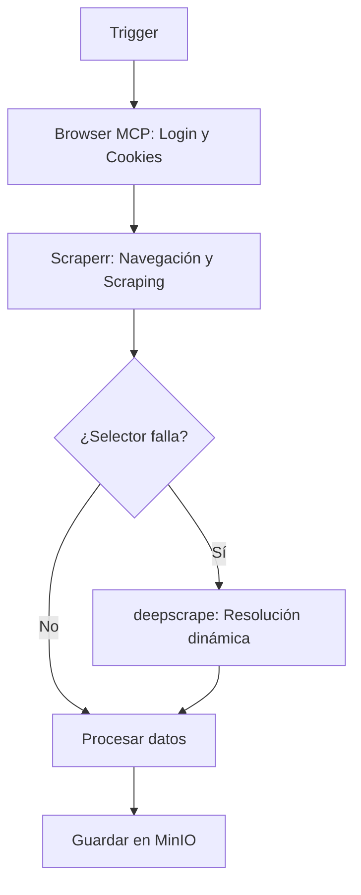

# Workflow de Orquestación Principal

## Flujo General

1. **Inicio del flujo**
   - Trigger manual, cron o comando externo.

2. **Gestión de sesión con Browser MCP**
   - Login en Farfetch
   - Rotación de fingerprint/proxy
   - Persistencia de sesión/cookies en MinIO

3. **Scraping básico con Scraperr**
   - Carga de sesión desde Browser MCP
   - Navegación y extracción de productos/ofertas
   - Si falla algún selector → fallback a deepscrape

4. **Resolución dinámica con deepscrape**
   - Identificación y resolución de elementos cambiantes
   - Actualización de selectores y reintento de scraping

5. **Persistencia y procesamiento**
   - Guardar datos y sesiones en MinIO
   - Procesamiento/filtrado de ofertas

---

## Diagrama de Flujo

---

## Notas
- Cada paso debe manejar errores y reintentos.
- El flujo es extensible para integración con Telegram o UI.
- Los datos y sesiones se persisten en MinIO para trazabilidad y recuperación. 